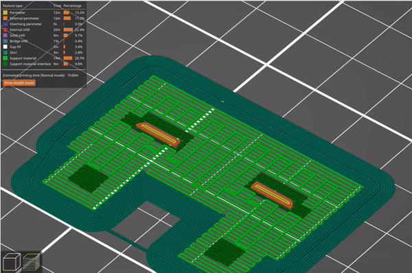
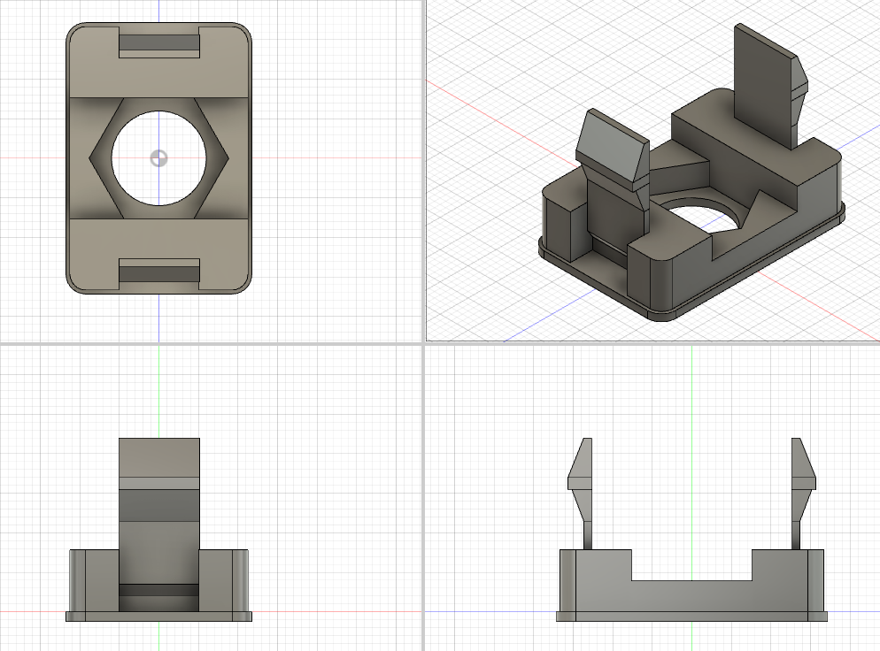

### Scion insert project

There are some small blank inserts beneath the drivers console on the left
side.  They are kinda the size of little buttons. I'll get a pic later.  This
is an attempt to clone and modify one of those so a switch can be inserted
through a hole in the face of the insert. [explore model](https://a360.co/34Yth9U)

### V2 documentation
description|visual
---|---
orbit around model |
slicer layer explore | 
model multiview |  
